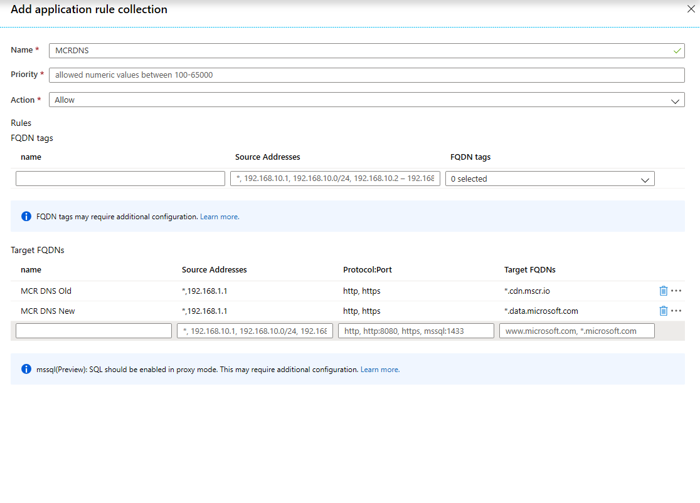

# Important Update to Microsoft Container Registry (MCR)!!!! 
MCR DNS Endpoint Changes for Client Firewall Rules

# Summary: 
If you have currently configured client firewall rules for MCR using FQDN *.cdn.mscr.io, you will need to change these rules to *.data.mcr.microsoft.com

# When is the change happening:
On March 3, 2020 the new firewall update will be implemented for MCR. You will follow the below steps to incorporate the changes on your firewall:
# Steps for users to implement this change:
1.	Update Fire wall rule: For customers who have configured client firewall rules for MCR using *.cdn.mscr.io, add the rule to include *.data.mcr.microsoft.com which will account for regionalized endpoints: eg: westus.data.mcr.microsoft.com. You can implement this change any time prior to the 3/x date.
2.	Test the new change on 3/x: After communication of the MCR change, test the update by removing the old outbound firewall rule (cdn.mscr.io) and ensure functionality by making a docker pull request to any mcr.microsoft.com image. This will ensure data transfer from the data endpoint. 
* Ex:

# Why are we making this change?
1.	To support well-known, trusted domains for customers authoring client firewall rules, MCR is moving the root data endpoint from mscr.io to mcr.microsoft.com
2.	To standardize MCR region monikers:
* Old standard: mcrwus0.cdn.mscr.io
* New standard: westus.data.mcr.microsoft.com
3.	To ensure consistency between ACR and MCR registry firewall rules – Both the registries will now follow a similar standard:
[registry].[region.data].[brand]

# MCR - Microsoft Container Registry
MCR (Microsoft Container Registry) is the primary Registry for all Microsoft Published docker images that offers a reliable and trustworthy delivery of container images with a syndicated catalog, while maintaining the quality that customers expect from a  Microsoft product offering. The discovery experience for these images is still maintained on Dockerhub, with the responsibility of servicing the images maintained by MCR, hence MCR does not have its own Catalog UI experience. You can find more details on MCR at this [blog](https://cloudblogs.microsoft.com/opensource/2019/01/17/improved-discovery-experience-microsoft-containers-docker-hub/)

Since MCR has no UI of its own, this Github is a means to take customer inputs and feedback. Please use this repo to provide your feedback on usage or concerns with MCR.

# FAQ
* How does MCR work with Dockerhub?  MCR is a public registry that houses Microsoft Published images but it does not have its own catalog UI experience. Docker Hub is the official source for our customers to discover official Microsoft-published container images. For further details of this integration please visit our [blog](https://cloudblogs.microsoft.com/opensource/2019/01/17/improved-discovery-experience-microsoft-containers-docker-hub/)

* What is the difference between MCR and ACR(Azure Container Registry)?  MCR is a public registry for housing only Mcirosoft's official Container images. ACR is a private container Registry for housing Our customers container Images.

* Can I browse MCR? No, MCR does not have a UI/discovery experience, the only experience with the registry is for interacting with a container image. Ex: docker pull mcr.microsoft.com/windows/servercore:ltsc2019

* Can I Onboard new Images to MCR? No, Given that MCR is meant to host only official Microsoft Container Images, only Internal Microsoft Product teams will be able to onboard images to the registry. Once onboarded, the images are available to all public users.

# Contributing
This project welcomes contributions and suggestions.  Most contributions require you to agree to a
Contributor License Agreement (CLA) declaring that you have the right to, and actually do, grant us
the rights to use your contribution. For details, visit https://cla.microsoft.com.

When you submit a pull request, a CLA-bot will automatically determine whether you need to provide
a CLA and decorate the PR appropriately (e.g., label, comment). Simply follow the instructions
provided by the bot. You will only need to do this once across all repos using our CLA.

This project has adopted the [Microsoft Open Source Code of Conduct](https://opensource.microsoft.com/codeofconduct/).
For more information see the [Code of Conduct FAQ](https://opensource.microsoft.com/codeofconduct/faq/) or
contact [opencode@microsoft.com](mailto:opencode@microsoft.com) with any additional questions or comments.

# Legal Notices

Microsoft and any contributors grant you a license to the Microsoft documentation and other content
in this repository under the [Creative Commons Attribution 4.0 International Public License](https://creativecommons.org/licenses/by/4.0/legalcode),
see the [LICENSE](LICENSE) file, and grant you a license to any code in the repository under the [MIT License](https://opensource.org/licenses/MIT), see the
[LICENSE-CODE](LICENSE-CODE) file.

Microsoft, Windows, Microsoft Azure and/or other Microsoft products and services referenced in the documentation
may be either trademarks or registered trademarks of Microsoft in the United States and/or other countries.
The licenses for this project do not grant you rights to use any Microsoft names, logos, or trademarks.
Microsoft's general trademark guidelines can be found at http://go.microsoft.com/fwlink/?LinkID=254653.

Privacy information can be found at https://privacy.microsoft.com/en-us/

Microsoft and any contributors reserve all other rights, whether under their respective copyrights, patents,
or trademarks, whether by implication, estoppel or otherwise.
